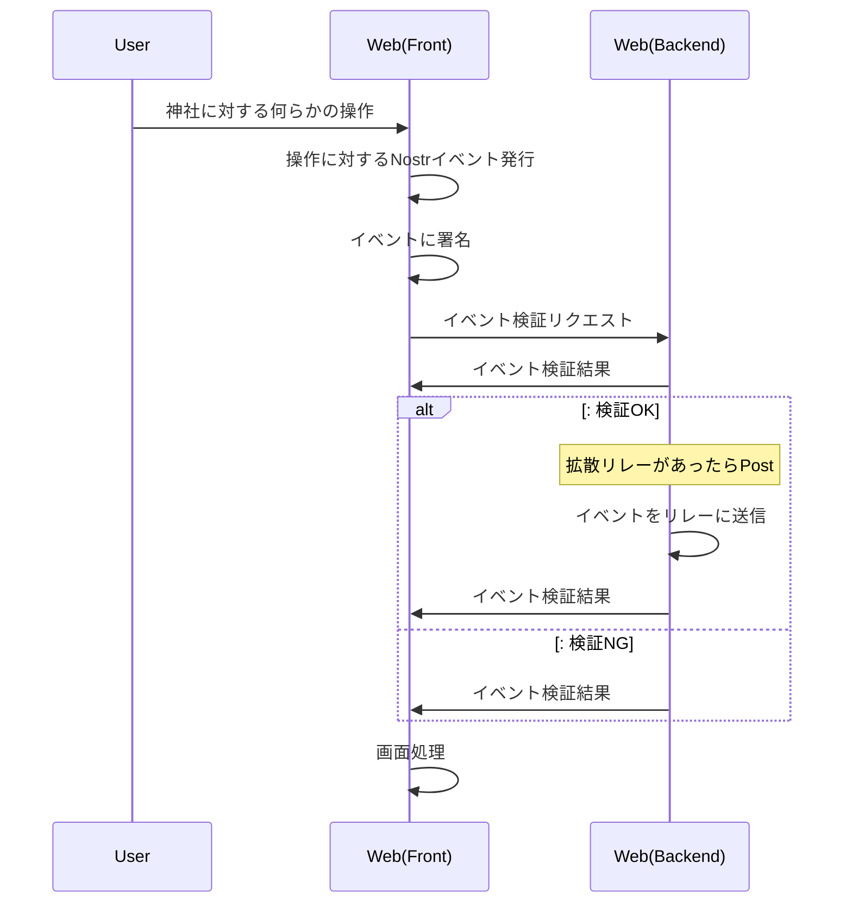

# Nostr神社 ⛩️

**Nostr上で楽しめるデジタルおみくじ・参拝システム**

Nostr神社は、SNSシェアやデジタル参拝を通じて、おみくじを引いて運勢を占えるシンプルなWebアプリケーションです。

## 🌸 Nostr神社とは

Nostr神社は、以下のシンプルな機能を提供します：

- **🎲 デジタルおみくじ**: SNSシェアや参拝でおみくじを引ける
- **⛩️ 1日1回参拝**: 毎日参拝してポイントを貯められる
- **🔐 NIP-07ログイン**: Nostrクライアント（Alby、nos2x等）でログイン
- **📱 SNSシェア**: ティザーサイトのシェアボタンでおみくじが引ける
- **💎 参拝ポイント**: 継続参拝でポイントを貯めて特別なおみくじも

## 🎯 主な機能

### おみくじシステム
- **SNSシェアおみくじ**: ティザーサイトのSNSシェアボタンを押すとおみくじが引ける
- **参拝おみくじ**: 毎日の参拝でおみくじを引ける
- **運勢表示**: 大吉・中吉・小吉・凶などの運勢とメッセージ

### 参拝システム
- **1日1回参拝**: 毎日1回だけ参拝可能（日付チェック機能）
- **参拝ポイント**: 継続参拝でポイントが貯まる
- **参拝履歴**: 過去の参拝記録を確認可能

### 認証システム
- **NIP-07対応**: Nostrクライアント拡張機能でログイン
- **署名イベント**: バックエンドで日付検証後に署名されたイベントを投稿

## 🏗️ システム構成

本システムは以下の技術スタックで構築されています：

- **バックエンド**: Cloudflare Workers + KV（イベントラッピング・署名システム）
- **フロントエンド**: Svelte（SPA）
- **プロトコル**: Nostr（NIP-07対応）
- **認証**: Nostrクライアント拡張機能（Alby、nos2x等）

### ディレクトリ構成
```
nostr-shrine/
├── cf/                 # Cloudflare Workers（バックエンド）
│   ├── src/
│   │   └── worker.ts   # イベントラッピング・署名API
│   └── scripts/        # 神社鍵ペア生成
└── apps/web/           # Svelte UI
    └── src/
        └── routes/     # おみくじ・参拝画面
```

## アクティビティの署名検証アーキテクチャ

### 通常のイベント検証ロジック



## 🚀 クイックスタート

### 1. バックエンドのセットアップ
```bash
# プロジェクトのクローン
git clone <repository-url>
cd nostr-shrine

# バックエンドのセットアップ
cd cf
npm install

# 神社の鍵ペア生成
npm run generate-keys

# 開発サーバー起動
npm run dev
```

### 2. フロントエンドのセットアップ
```bash
# 別ターミナルで
cd apps/web
npm install
npm run dev
```

### 3. 使い方
1. ブラウザで `http://localhost:5173` にアクセス
2. Nostrクライアント（Alby、nos2x等）をインストール・設定
3. NIP-07でログイン
4. おみくじを引いたり、参拝してポイントを貯める

## 🎌 機能詳細

### SNSシェアおみくじ
- ティザーサイトのSNSシェアボタンをクリック
- 自動的におみくじが引かれて結果が表示される
- 運勢とメッセージが表示される

### 参拝システム
- **1日1回制限**: 署名されたイベントで日付を検証し、1日1回のみ参拝可能
- **ポイント獲得**: 参拝するとポイントが貯まる
- **継続ボーナス**: 連続参拝でボーナスポイント
- **特別おみくじ**: 一定ポイントで特別なおみくじが引ける

### 技術的な実装
- **イベントラッピング**: バックエンドでユーザーのイベントを神社が署名してラッピング
- **署名検証**: イベントID・署名・時間制限（±5分）・kind制限をチェック
- **リレー中継**: 神社が署名したイベントを指定されたリレーに送信

## 🔧 開発状況

### 実装済み
- ✅ **Cloudflare Workers バックエンド**: イベントラッピング・署名システム
- ✅ **署名検証システム**: nostr-toolsによる厳密な検証
- ✅ **リレー中継機能**: WebSocketによるリレー送信
- ✅ **Svelteフロントエンド基盤**: 基本的なUI構成
- ✅ **NIP-07ログイン機能**: Nostrクライアント連携

### 開発中・設計中（デバッグ神社で実装したい機能）
- 🚧 **1日1回参拝制限**: 署名イベントによる日付検証システム
- 🚧 **ポイントシステム**: 参拝ポイントの管理・計算
- 🚧 **SNSシェア機能**: ティザーサイトのシェアボタン連携
- 🚧 **おみくじロジック**: 運勢判定とメッセージ生成

### 今後の予定
- 📋 参拝履歴の表示
- 📋 特別おみくじの実装
- 📋 継続参拝ボーナス
- 📋 UI/UXの改善

## 📚 関連ドキュメント

- **[API仕様書](./API.md)**: イベントラッピング・署名システムの技術詳細
- **[Swagger仕様書](./swagger.yaml)**: OpenAPI 3.0.3形式のAPI仕様
- **[Nostr仕様](https://github.com/nostr-protocol/nips)**: Nostrプロトコルの公式仕様

## 🛠️ バックエンドAPI

現在実装されているバックエンドAPIは以下の通りです：

### エンドポイント
- `GET /health` - ヘルスチェック
- `GET /shrine/pubkey` - 神社の公開鍵取得
- `POST /wrap` - イベントラッピング・署名・リレー中継

### `/wrap` エンドポイントの動作
1. ユーザーが署名したNostrイベントを受信
2. 署名・ID・時間制限（±5分）・kind制限をチェック
3. 神社の検証済みイベントを生成
   - 受け取ったイベントをJSONでcontentに設定してラッピング
   - kind = 元のkind + 100 として設定（例：kind 1 → kind 101、kind 30023 → kind 30123）
   - これによりタイムラインに表示されず、神社認証済みイベントとして識別可能
   - tagsに以下を追加して元のイベントが追跡可能にする：
     - `["e", "元のイベントID", "", "mention"]` - 元のイベントを参照
     - `["original_author", "元の投稿者の公開鍵"]` - 元の投稿者を参照（通知なし）
     - `["original_kind", "元のkind"]` - 元のイベントkindを記録
   - カスタムタグを使用することで通知を完全に回避し、神社認証の証明として機能する
4. 神社の秘密鍵でラッピングしたイベントに署名
5. 指定されたリレーに神社署名済みイベントを送信
6. ラッピング済みイベントをレスポンスで返却

## 🌟 特徴

- **🎲 シンプル**: おみくじと参拝に特化したシンプルな機能
- **🔐 NIP-07対応**: Nostrクライアント拡張機能でかんたんログイン
- **📱 SNS連携**: ティザーサイトのシェアボタンでおみくじ
- **⛩️ 継続参拝**: 毎日の参拝でポイントを貯める楽しさ
- **🌐 分散型**: Nostrプロトコルによる分散型アーキテクチャ

## 📄 ライセンス

MIT License - 詳細は [LICENSE](./LICENSE) ファイルを参照してください。

## 🙏 謝辞

このプロジェクトは以下の技術・コミュニティに支えられています：

- [Nostr Protocol](https://github.com/nostr-protocol/nips) - 分散型ソーシャルプロトコル
- [Cloudflare Workers](https://workers.cloudflare.com/) - エッジコンピューティングプラットフォーム
- [Svelte](https://svelte.dev/) - モダンWebフレームワーク
- [nostr-tools](https://github.com/nbd-wtf/nostr-tools) - Nostrライブラリ
